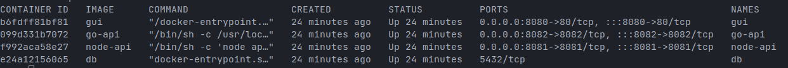
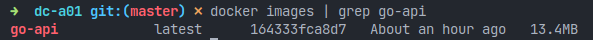
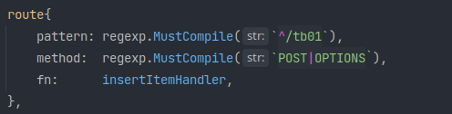
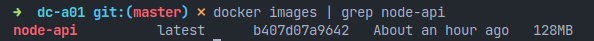
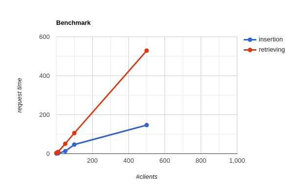

# Overview

The proficiency test  was built keeping in mind his correction, due to this fact, the services were containerized.



Tying up, each step of the proficiency test was placed in a container application.


# Deploy

1. Cloning

```bash
git clone https://github.com/ojalmeida/dc-a01 && cd dc-a01
```

2. Start services

```bash
docker compose up -d
```
3. Check services

```bash
docker compose ps
```

# Services

## DB

The database service was built over postgresql alpine-based image from oficial repository.

>Alpine-based images contains only essential software an tend to be much smaller than others, such debian-based

`Data Definition Language` script (db/ddl.sql) was written to initialize database correctly.

## GUI

The `Graphic User Interface`, were the 2nd hardest part, due to the my lack of experience with front-end and Javascript

The webpage was firstly sketched in Figma platform (`gui/draft.png`), what helped a lot in the development.

> No Javascript frameworks (Angular, React, etc) or CSS extensions (SCSS, Sass, etc) were used, half due to inexperience, half by no necessity of more complexity.

## Go-API

The Golang API was the easiest and most enjoiable part :D 

The service image was built making use of multi stage image build, again, making use of alpine base image, the final image takes only 13.4 MB.



The HTTP default package, as mentioned in test requirements, was used. As an improvement, I made use of a personal implementation of `fan-in`queue architecture to be able to control concurrency level.

> Default HTTP package inits an goroutine on every new incoming request, this can be dangerous, in a DDoS scenery, by example.

The request routing makes use of regexp.Regexp, due to another personal implementation (`go/server/routes.go`), what increases maintainability, by offering a more clever and readable approach.




Such as Node-API, the Go-API logs information to `stdout` and `stderr`, with this approach, the loggin can be delegated easily to `Kubernetes logging system` or, in this case, to `Docker logging system`.

## Node-API

The Node.Js API was built over `express` module, such was mentioned in test specification.

The service image was also build over alpine, from node:14-alpine image.



This service was the hardest part of the project, primarily by the `Promise` concept, what I think that has a big learning curve :(

# Performance

Benchmark was made with Apache Benchmark.

Appliance specification:

- CPU: Intel Core i3-10100 4.3GHz
- Memory: 16GB DDR4 2333Mhz



